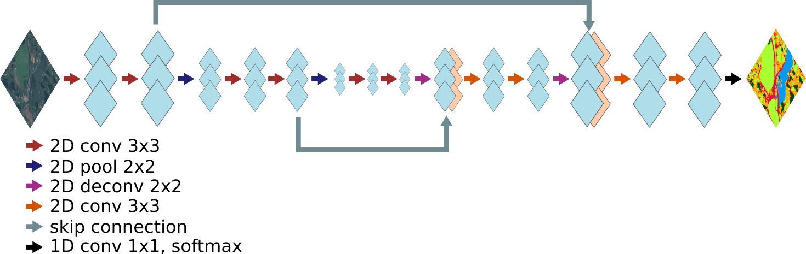
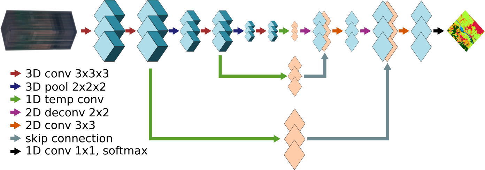

# Models

## Fully-Convolutional-Network (FCN)

The vanilla architecture as in the following figure is implemented. Convolutions are run along spatial dimensions of input tensor, which is supposed to have `[M, H, W, D]` shape, where M is the mini-batch size, and H, W and D are the height, width and number of bands (i.e. depth) of the input image tensor. The 2d convolutions perform a `VALID` convolution, therefore the output tensor size is smaller than the input size.



An example training script is provided. To run it execute the `configs/fcn_example.json` configuration:
```
python -m eoflow.execute configs/fcn_example.json
```

The example configuration can be used as a base to run your own experiments.

## Temporal Fully-Convolutional-Network (TFCN)

Similarly to the RFCN, the TFCN works with time-series of input shape `[M, T, H, W, D]`. This network performs 3d convolutions along the tempo-spatial dimensions, i.e. the convolutional kernels are 3d `k x k x k`. As default, the temporal dimension is not pooled. For temporal pooling, enough time-frames need to be available in the input tensors. At the bottom of the TFCN and along the skip connections, a 1d convolution along the temporal dimension is performed to linearly combine the temporal features. The resulting tensors are 4d of shape `[M, H, W, D]`. The decoding path is as in FCN.



An example training script is provided. To run it execute the `configs/tfcn_example.json` configuration:
```
python -m eoflow.execute configs/tfcn_example.json
```

The example configuration can be used as a base to run your own experiments.

## Recurrent Fully-Convolutional-Network (RFCN)

A recurrent version of the **FCN** is implemented as in below figure. The input tensor in this case is 5d with shape `[M, T, H, W, D]`, where `T` is the number of temporal acquisitions. As for the FCN, the 2d convolutions operate along the `H` and `W` dimensions. The recurrent layers are applied along the skip connections and the bottom layers to model the temporal relationship between the features extracted by the 2d convolutions. The output of the recurrent layers is a 4d tensor of shape `[M, H, W, D]` (the height, width and depth of the tensors will vary along the network). The decoding path is as in **FCN**. The 2d convolutions perform a `VALID` convolution, therefore the output tensor size is smaller than the input size.


An example training script is provided. To run it execute the `configs/rfcn_example.json` configuration:
```
python -m eoflow.execute configs/rfcn_example.json
```

The example configuration can be used as a base to run your own experiments.
