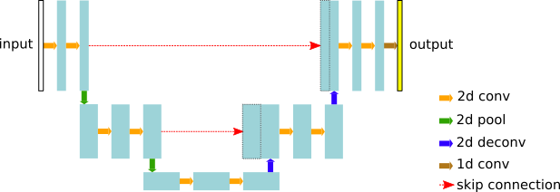
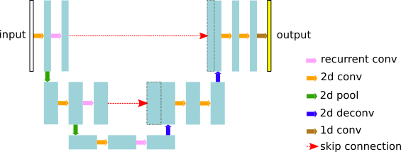
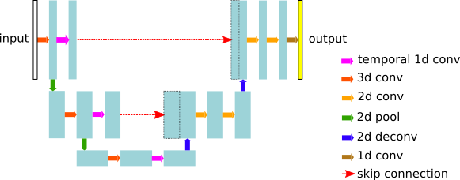

# EOFlow

This repository provides a templated structure to generate TensorFlow projects. Using the same base structure for all TF projects should benefit model creation, debugging and experiments reproducibility.

The project contains the package `eoflow` which contains the base abstract classes and implements the common models, tasks and input methods. Custom models tasks and input methods can also be implemented building on top of the provided abstract classes.

The package can be installed by running the following command.
```
$ pip install git+https://github.com/sentinel-hub/eo-flow
```

You can also install the package from source. Clone the repository and run the following command in the root directory of the project.
```
$ pip install .
```

The project also contains example configurations to run common tasks on implemented models. Examples of implementing and running custom models and input methods are also provided.

## Package structure

The structure is inspired by the tensorflow [Estimator API](https://www.tensorflow.org/guide/custom_estimators).

The subpackages of `eoflow` are as follows:
* `base`: this directory contains the abstract classes to build models, inputs and tasks. Any useful abstract class should go in this folder.
* `models`: classes implementing the TF models (e.g. Fully-Convolutional-Network, GANs, seq2seq, ...). These classes inherit and implement the `BaseModel` abstract class.
* `tasks`: classes handling the actions that can be applied to each TF model. These actions may include training, inference, exporting the model, validation, etc. The tasks inherit the `BaseTask` abstract class. Currently only the training task is implemented in `TrainTask` class.
* `input`: these classes handle the loading of the input data into a tf Dataset. These classes may be specific to the problem and data at hand, but can also contain common classes for reading certain type of data (EOPatch, np arrays, etc.). Currently only random input data generation is implemented.
* `utils`: collection of utility functions

## Examples and scripts

Project also contains other folders:
* `configs`: folder containing example configurations for different models. Config parameters are stored in .json files. Results of an experiment should be reproducible by re-running the same config file. Config files specify the whole workflow (model, task, data input if required).
* `examples`: folder containing example implementations of custom models and input functions. Also contains a jupyter notebook example.

## Currently implemented projects

The projects currently implemented are:
* Fully-Convolutional-Network (FCN, a.k.a. U-net), vanilla implementation of method described in this [paper](https://arxiv.org/abs/1505.04597). This network expects 2D MSI images as inputs and predicts 2D label maps as output.
* Recurrent FCN, where a time series is used as input and the temporal dependency between images is modelled by recurrent convolutions. The output of the network is a 2D label map as in previous case.
* Temporal FCN, where the whole time-series is considered as a 3D MSI volume and convolutions are performed along the temporal dimension as well spatial dimension. The output of the network is a 2D label map as in previous cases.

### Fully-Convolutional-Network (FCN)

The vanilla architecture as in the following figure is implemented. Convolutions are run along spatial dimensions of input tensor, which is supposed to have `[M, H, W, D]` shape, where M is the mini-batch size, and H, W and D are the height, width and number of bands (i.e. depth) of the input image tensor. The 2d convolutions perform a `VALID` convolution, therefore the output tensor size is smaller than the input size.



An example training script is provided. To run it execute the `configs/fcn_example.json` configuration:
```
python -m eoflow.execute configs/fcn_example.json
```

The example configuration can be used as a base to run your own experiments.

### Recurrent Fully-Convolutional-Network (RFCN)

A recurrent version of the **FCN** is implemented as in below figure. The input tensor in this case is 5d with shape `[M, T, H, W, D]`, where `T` is the number of temporal acquisitions. As for the FCN, the 2d convolutions operate along the `H` and `W` dimensions. The recurrent layers are applied along the skip connections and the bottom layers to model the temporal relationship between the features extracted by the 2d convolutions. The output of the recurrent layers is a 4d tensor of shape `[M, H, W, D]` (the height, width and depth of the tensors will vary along the network). The decoding path is as in **FCN**. The 2d convolutions perform a `VALID` convolution, therefore the output tensor size is smaller than the input size.



An example training script is provided. To run it execute the `configs/rfcn_example.json` configuration:
```
python -m eoflow.execute configs/rfcn_example.json
```

The example configuration can be used as a base to run your own experiments.

### Temporal Fully-Convolutional-Network (TFCN)

Similarly to the RFCN, the TFCN works with time-series of input shape `[M, T, H, W, D]`. This network performs 3d convolutions along the tempo-spatial dimensions, i.e. the convolutional kernels are 3d `k x k x k`. As default, the temporal dimension is not pooled. For temporal pooling, enough time-frames need to be available in the input tensors. At the bottom of the TFCN and along the skip connections, a 1d convolution along the temporal dimension is performed to linearly combine the temporal features. The resulting tensors are 4d of shape `[M, H, W, D]`. The decoding path is as in FCN.



An example training script is provided. To run it execute the `configs/tfcn_example.json` configuration:
```
python -m eoflow.execute configs/tfcn_example.json
```

The example configuration can be used as a base to run your own experiments.

## Custom models and input functions

In order to create your own model, create a new class that inherits from `BaseModel` or any of its subclasses. The model must specify a schema for its configuration and a function `build_model` that builds the model with the provided input and label tensors. Look at the example implementation for more details.

The package `eoflow` contains a few of the most common input methods. It also provides common dataset building blocks: EOPatch loading, subpatch extraction, data augmentation. You can use these functions to create a custom input method that fits you data and model. To implement a custom input method create a new class that inherits from `BaseInput` or any of its subclasses. The input method must specify a schema for its configuration and a function `get_dataset` that builds a tensorflow Dataset that reads the input data. For further details look at the example implementation.

Implementations in files `examples/models.py` and `examples/input.py` are available as guidelines on how the configurable classes for **models** and **input** should be implemented.

A toy example using the example model and input is configured in the`configs/example.json` configuration file.

To run the example, run
```
$ python -m eoflow.execute configs/example.json
```
This will create an output folder `temp/experiment` containing the tensorboard logs and model checkpoints.

To visualise the logs in TensorBoard, run
```
$ tensorboard --logdir=temp/experiment
```

## Programatic use

Notebook `examples/notebook.ipnyb` shows how `eoflow` can be also used in code. The notebook shows model building, defining the input datasets, training, evaluation and prediction.
